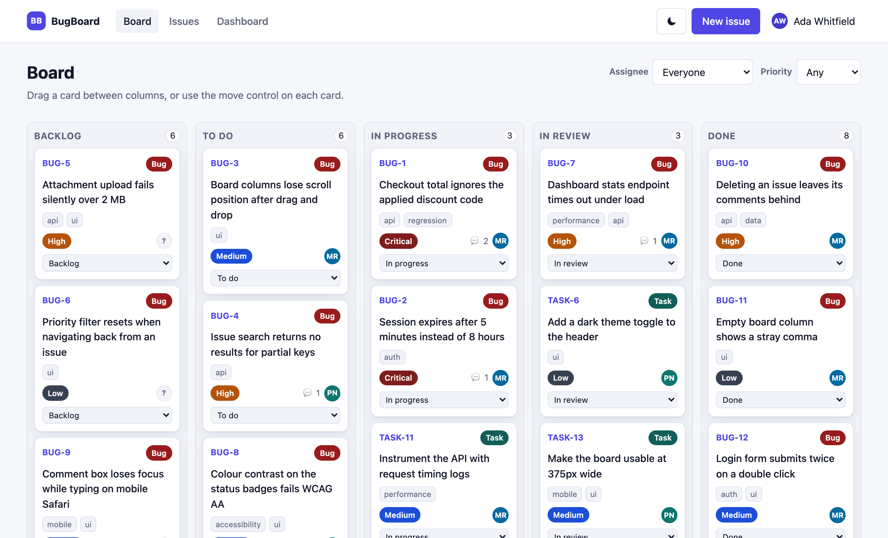
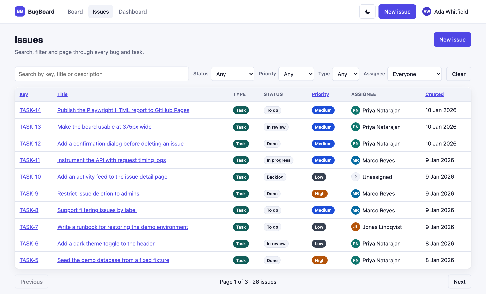
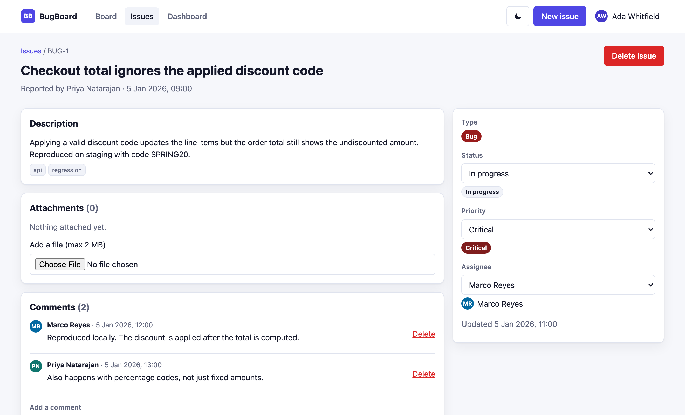
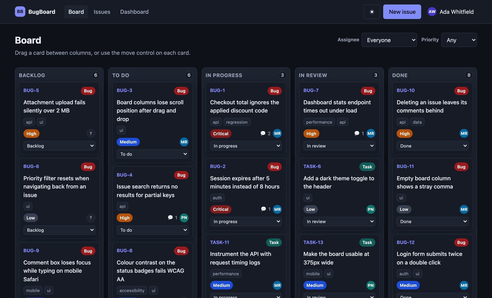

# BugBoard

A small bug tracker with a kanban board — React + TypeScript on the front, Express + TypeScript on the back.

It is a real app, but it exists for a specific reason: **to be a good target for end-to-end tests.** Every feature
here was chosen because it is something worth testing — authentication, validation, async loading, drag and drop,
pagination, file upload, role-based permissions. The companion repository
[bugboard-e2e](https://github.com/mariusuncrop/bugboard-e2e) tests it with Playwright.



<details>
<summary>More screenshots</summary>

**Issue list** — search, filters, sorting and pagination, all held in the URL



**Issue detail** — inline editing, comments, attachments



**Dark theme**



</details>

## Quick start

```bash
npm install
npm run dev
```

- Web app → <http://localhost:5173>
- API → <http://localhost:4000>

No database to install, no environment file to write — the API keeps its data in a JSON file and seeds itself on
first run. Sign in with any demo account below.

Prefer containers?

```bash
docker compose up --build
```

That serves the built frontend and the API together on <http://localhost:4000>.

## Projects

Issues belong to a project, and a project decides who can see them.

| Project | Members | Issues |
| --- | --- | --- |
| `WEB` Web Storefront | everyone | 11 |
| `API` Platform API | Ada, Marco, Priya | 11 |
| `MOB` Mobile App | Ada, Jonas | 4 |

The rules:

- **Only an admin can create a project**, or add and remove its members.
- **Everyone else sees only the projects they belong to** — in the switcher, in the project list, and through the API.
- **Admins see every project** without being added to it.
- A project a user cannot see returns `404`, not `403`. Answering "forbidden" would confirm it exists.
- An issue can only be assigned to a member of its own project. Removing someone from a project unassigns the work
  they held there.
- Issue keys are prefixed per project and numbered from one inside it: `WEB-1`, `API-1`, `MOB-1`.

The membership is deliberately uneven — Marco and Priya are not on Mobile App, Jonas is not on Platform API. Without
a user who is missing from something, "you only see your projects" is not actually testable.

## Demo accounts

| Email | Role | Notes |
| --- | --- | --- |
| `admin@bugboard.dev` | admin | The only role allowed to delete issues |
| `dev@bugboard.dev` | member | |
| `qa@bugboard.dev` | member | |
| `pm@bugboard.dev` | member | |

The password for all of them is `Password123!`. The login screen lists the first three and fills the form when you
click one.

## What is in it

| Feature | Why it is here |
| --- | --- |
| Multiple projects, with membership | Authorisation that depends on data, not just on a role — the most interesting thing here to test |
| Token auth with a protected app shell | Session reuse, redirect-after-login, expired-token handling |
| Kanban board with drag and drop | Pointer gestures — plus a `<select>` on each card as the accessible equivalent |
| Issue list with search, filters, sorting and pagination | Filter state lives in the URL, so the back button and shared links both work |
| Create and edit forms with field-level validation | Client-side rules, mirrored by server-side rules that return per-field errors |
| Comments | Create, delete, and permission rules (authors and admins only) |
| File attachments | Multipart upload, a 2 MB cap, and a rejected MIME type list |
| Drag and drop | A drop zone on both the issue page and the creation form, wrapped around a real file input so the pointer gesture is never the only way in |
| Attaching files while filing an issue | Files are held client-side until the issue exists, then uploaded — a multi-step flow where the second step can fail on its own |
| Toasts, modals and confirmation dialogs | Transient UI that tests have to wait for rather than sleep through |
| A deliberately slow dashboard endpoint | A loading state that actually exists long enough to assert on |
| Role-based permissions | `member` gets `403 FORBIDDEN` where `admin` gets `204` |
| Light and dark themes | Preference stored in `localStorage` |

## Built for testing

Three things make this app pleasant to automate against, and they are the parts worth copying into a real project.

**1. A reset endpoint.** Every test run can start from an identical database:

```bash
curl -X POST http://localhost:4000/api/test/reset
```

The seed fixture is fully deterministic — fixed ids, fixed keys, fixed timestamps — so even visual snapshots are
stable. The endpoint is guarded by `ENABLE_TEST_ENDPOINTS` and must stay off in production.

**2. Stable test ids.** Every element a test needs carries a `data-testid`, following one convention:

| Pattern | Example |
| --- | --- |
| `<page>-<element>` | `login-email`, `issues-search`, `comment-submit` |
| `<thing>-<identifier>` | `issue-card-WEB-1`, `issue-row-WEB-3`, `column-todo`, `project-card-API` |
| `error-<field>` | `error-title`, `error-password` |

Issue keys (`WEB-1`, `API-4`) are stable across resets, so tests can address a specific card without first
scraping the page for an id.

**3. A documented API.** `GET /api/openapi.yaml` serves the full contract, so API tests and UI setup code can talk
to the same documented surface. Logging in over the API and reusing the token is much faster than driving the login
form before every test.

## API

Base URL `http://localhost:4000`. All endpoints need `Authorization: Bearer <token>` except login, health and reset.

```
POST   /api/auth/login              email + password → token
GET    /api/auth/me                 the current user
GET    /api/users                   all users, for admins building a project

GET    /api/projects                projects the caller can see
POST   /api/projects                create one — admin only
GET    /api/projects/:key           one project, with its members
GET    /api/projects/:key/members
POST   /api/projects/:key/members   { userId } — admin only
DELETE /api/projects/:key/members/:userId   admin only; unassigns their issues

GET    /api/projects/:key/issues    q, status, priority, type, assigneeId, label, sort, order, page, pageSize
POST   /api/projects/:key/issues    create
GET    /api/issues/:idOrKey         fetch by id or key (WEB-1); the project is implied
PATCH  /api/issues/:idOrKey         partial update
DELETE /api/issues/:idOrKey         admin only
POST   /api/issues/:idOrKey/move    { status, position } — the board drag

GET    /api/issues/:idOrKey/comments
POST   /api/issues/:idOrKey/comments
DELETE /api/comments/:id

GET    /api/issues/:idOrKey/attachments
POST   /api/issues/:idOrKey/attachments   multipart, field "file", max 2 MB
GET    /api/attachments/:id
DELETE /api/attachments/:id

GET    /api/config                  upload limits, so a client can reject a file before sending it
GET    /api/projects/:key/board     issues grouped into columns
GET    /api/projects/:key/stats     dashboard aggregates (deliberately slow)
POST   /api/test/reset              restore the seed fixture
GET    /api/health
```

Errors always take the same shape, which makes them easy to assert on:

```json
{
  "error": {
    "code": "VALIDATION_ERROR",
    "message": "The request body is invalid.",
    "details": [{ "path": "title", "message": "Title must be at least 5 characters." }]
  }
}
```

## Configuration

Every value has a working default, so `.env` is optional. See [.env.example](.env.example).

| Variable | Default | Purpose |
| --- | --- | --- |
| `PORT` | `4000` | API port |
| `WEB_PORT` | `5173` | Vite dev server port |
| `AUTH_SECRET` | `dev-only-secret-change-me` | Token signing secret |
| `ENABLE_TEST_ENDPOINTS` | `true` | Exposes `POST /api/test/reset` |
| `STATS_DELAY_MS` | `1200` | Artificial latency on `/api/stats` |
| `MAX_UPLOAD_BYTES` | `2097152` | Attachment size cap |

## Project layout

```
server/            Express + TypeScript API
  src/routes/      One router per resource
  src/seed.ts      The deterministic fixture
  src/store.ts     JSON-file persistence, and the reset used by tests
  openapi.yaml     API contract, served at /api/openapi.yaml
web/               React + TypeScript frontend (Vite)
  src/pages/       One component per route
  src/components/  Shared UI
  src/lib/         API client, auth context, toasts, formatting
```

## Scripts

| Command | What it does |
| --- | --- |
| `npm run dev` | API and web dev server together |
| `npm run build` | Compile the API and bundle the frontend |
| `npm start` | Serve the built app on one port |
| `npm run typecheck` | Type check both workspaces |
| `npm run seed` | Reset the database to the seed fixture |

## Notes

This is demo software. Passwords are stored in plain text in a JSON file, the auth secret has a default, and the
reset endpoint wipes the database on request — all deliberate, none of it suitable for anything real.

## Licence

[MIT](LICENSE)
